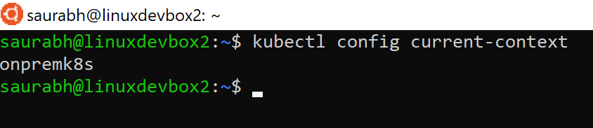
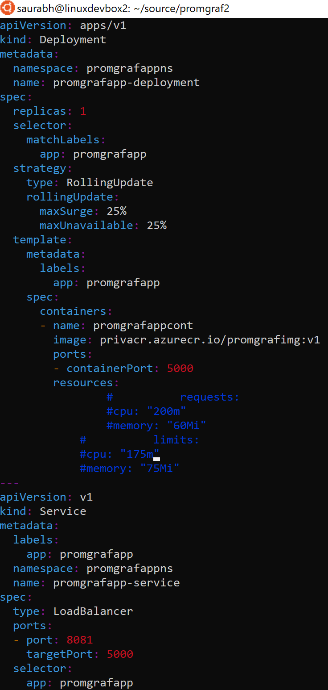

# Access Azure Container Registry (ACR) using Azure Private Link from a Kubernetes cluster hosted in a remote environment

## Aim:
To access Azure Container Registry (ACR) using Azure Private Link from a Kubernetes cluster hosted at on-prem/Azure-on-different-tenant/other-cloud-platforms.

## Backdrop: 
For better security, ACR endpoints should always be accessed over a private IP address. This is made possible using Azure Private Link where a private IP address from a Virtual Network is assigned to the ACR endpoint.  
However, the challenge comes when the same ACR endpoint needs to be accessed from a different hosting environment like an Azure Subscription belonging to a different tenant, an on-prem or a different cloud platform.    
This article aims to explain one of the reference architectures to address this challenge. 

## Reference Architecture:

## Reference Architecture components: 
For the sake of simplicity, the entire set-up for this PoC would be spread across two Azure regions – <b>Southeast Asia</b> and <b>East US2</b>. The <b>Southeast Asia</b> region would depict the primary Azure region and the <b>East US2</b> would be <b>simulating</b> an on-prem environment or an environment on an Azure subscription belonging to a different tenant or any other cloud provider.   
Service instances deployed in <b>Azure’s Southeast Asia</b> region:   
<b>azure-vnet (172.18.0.0/16):</b> VNet created on Azure housing all the Azure workloads. 
<b>azuregw:</b> Virtual Network Gateway (VPN) on Azure. 
<b>azurek8s:</b> AKS cluster on Azure. 
<b>privacr (172.18.1.5):</b> ACR with a private IP. 
<b>azurednsvm (172.18.2.4):</b> Ubuntu VM on Azure with <b>bind9</b> installed for providing the DNS functionality. The VNet <b>azure-vnet (172.18.0.0/16)</b> is configured to have <b>azurednsvm (172.18.2.4)</b> as its custom DNS Server. 
    

<b>privatelink.azurecr.io: </b> Private DNS Zone in Azure which has the mapping information of the ACR privacr to its private IP address.
    

Since the Private Link for <b>privacr</b> was created in the VNet <b>azure-vnet (172.18.0.0/16)</b>, this VNet is linked to the Private DNS Zone <b>privatelink.azurecr.io</b>
    

Service instances deployed in Azure’s <b>East US2</b> region – which is <b>simulating</b> an on-prem environment or an environment on an Azure subscription belonging to a different tenant or any other cloud provider:   
<b>onprem-vnet (10.0.0.0/16):</b> VNet simulating a private network belonging to any other environment. 
<b>onpremgw:</b> Virtual Network Gateway (VPN) on Azure simulating a VPN Gateway on any other environment. 
<b>onpremk8s:</b> AKS cluster simulating any Kubernetes cluster on any other environment. 
<b>onpremdns-vm (10.0.1.4):</b> Ubuntu VM on Azure with <b>bind9</b> installed simulating a DNS server on any other environment. The VNet <b>onprem-vnet (10.0.0.0/16)</b> is configured to have <b>onpremdns-vm (10.0.1.4)</b> as its custom DNS Server. 
    

## Flow: 
1. <b>onpremk8s</b> needs to access <b>privacr</b> to fetch the desired image. <b>onpremk8s</b> sends a DNS query to the DNS server <b>onpremdns-vm</b> to fetch the private IP of <b>privacr</b> FQDN – <b>privacr.azurecr.io</b>  
2. The <b>onpremdns-vm</b> DNS server is a forwarder which will forward this DNS query to the VM based DNS server on Azure by the name <b>azurednsvm (172.18.2.4)</b>. This request will flow via a VPN tunnel set between <b>onprem-vnet</b> and <b>azure-vnet</b>. Below is how the <b>/etc/bind/named.conf.options</b> file of bind will look on the <b>onpremdns-vm</b>, for forwarding all the requests to <b>azurednsvm (172.18.2.4):</b> 
    

3. <b>azurednsvm</b> will receive this DNS query and will forward the query to <b>Azure Internal DNS Resolver (168.63.129.16)</b>. Below is how the <b>/etc/bind/named.conf.options</b> file of <b>bind</b> will look on the <b>azurednsvm</b>, for forwarding all the requests to the <b>Azure Internal DNS Resolver 168.63.129.16</b>: 
    

4. <b>Azure Internal DNS Resolver (168.63.129.16)</b> will resolve the DNS query for the FQDN - <b>privacr.azurecr.io</b> and will return the private IP of <b>privacr</b> which is - <b>172.18.1.5.</b> This information will be sent from the <b>Azure Internal DNS Resolver (168.63.129.16)</b> to <b>azurednsvm</b> and later to <b>onpremdns-vm</b> which will be used by the AKS cluster <b>onpremk8s</b> to fetch the image from <b>privacr</b>.  

## Please note: 
In this set-up, the VM based DNS servers <b>onpremdns-vm</b> and <b>azurednsvm</b> both are configured to forward all the DNS queries to the other DNS server. This is done in the PoC for simplicity. Please note than in production scenarios conditional forwarding will be needed to be enabled by configuring the zone for the ACR FQDN and have only the requests related to the ACR’s FQDN to be forwarded to the VM based DNS server on Azure. The same can be done by creating the zone related configuration in bind’s <b>named.conf</b> file which can be found at: <b>/etc/bind/named.conf.local.</b>   

## Accessing ACR from a Kubernetes cluster over private IP – in action:
<b>onpremk8s</b> is the AKS cluster which is simulating a Kubernetes cluster set-up in a remote location.  
    
To verify that this AKS cluster can access the ACR <b>privacr</b>, the <b>dnsutils</b> pod is used (mentioned in reference) to confirm if the <b>privacr</b> FQDN <b>privacr.azurecr.io</b> resolves to the private IP address <b>172.18.1.5.</b>  
    
The above screenshot shows that it can do so.  

Now we will create a service and a deployment. The deployment will use an image in <b>privacr.</b> 
    

Below is the manifest file used for creating the pod and the service: 
    

We create the deployment and the service  
    

We see that the service and the deployment got created successfully. 
    

Testing the application, we see that it is getting executed perfectly well.  
    
    

## Conclusion:
With the help of this reference architecture, a Kubernetes cluster residing in an environment was able to access the Azure Container Registry in another environment using a private IP.  

## Reference links:
<b>Azure Kubernetes Service:</b> https://docs.microsoft.com/en-us/azure/aks/  
<b>Azure Container Registry:</b> https://docs.microsoft.com/en-us/azure/container-registry/  
<b>Azure Private Link with Azure Container Registry:</b> https://docs.microsoft.com/en-us/azure/container-registry/container-registry-private-link  
<b>Azure Virtual Machines:</b> https://docs.microsoft.com/en-us/azure/virtual-machines/  
<b>BIND:</b> https://www.bind9.net/  
<b>Debugging DNS resolution in Kubernetes:</b> https://kubernetes.io/docs/tasks/administer-cluster/dns-debugging-resolution/  

## Co-author information:
<b>Sumit Kute (Cloud Solution Architect @ Microsoft)</b> worked with me on the prototype and the content used for this article.   His GitHub id is: https://github.com/sumitkute

